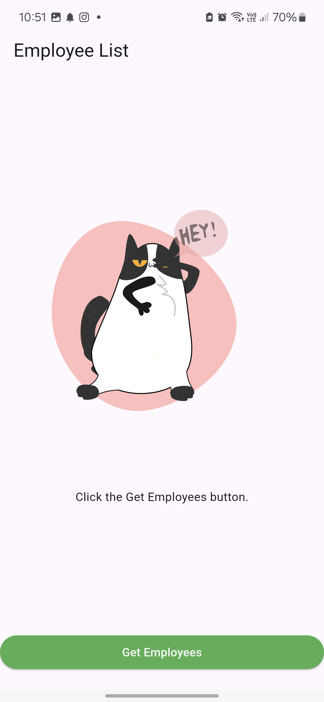
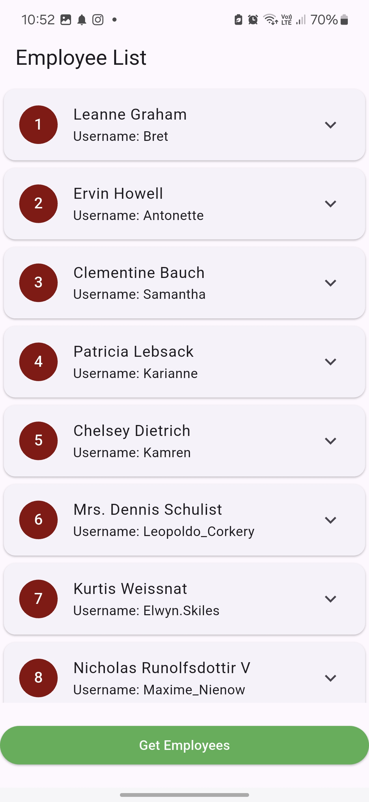
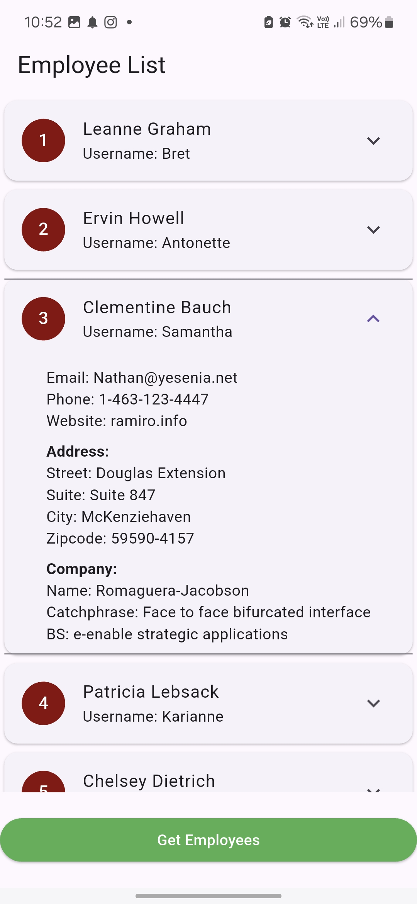

# sprints_http_task

A new Flutter project.

## Overview

This project is a simple task for Fetch employee data using HTTP then Parse JSON responses and map them to model.

1. Fetch employee data from the API endpoint:https://jsonplaceholder.typicode.com/users.
2. Use HTTP for API call.
3. Parse JSON responses and map them to an Employee Model.

## 📸 Screens

    
    
    
    

